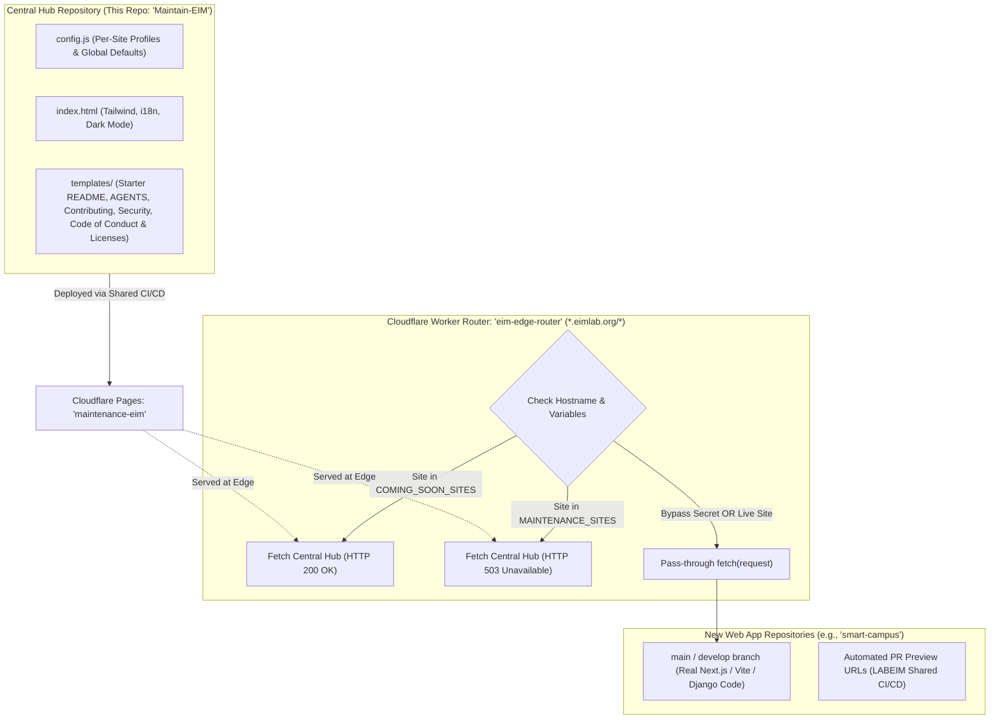

# EIM Lab Coming Soon & Maintenance Hub — Architecture & Setup Guide

This document outlines the standard architecture and step-by-step operating procedures for managing **Coming Soon (pre-launch)** and **Scheduled Maintenance** pages across all Enterprise Infrastructure Management (EIM) Research Laboratory domains (`*.eimlab.org`).

---

## 1. System Architecture Overview

To eliminate repository pollution, messy git branch management, and template conflicts, EIM Lab uses a **Centralized Edge Gateway Architecture**:



### Key Advantages:
1. **Zero Git Pollution in App Repos:** New application repositories develop on `main` and `develop` from Day 1 without storing temporary Coming Soon HTML/CSS files.
2. **Centralized Content Management:** All pre-launch metadata, bilingual headlines, countdown targets, and maintenance texts for all lab domains are configured in one central file: [config.js](config.js).
3. **SEO-Compliant Status Codes:**
   - **Coming Soon:** Emits `200 OK` with indexable tags for early Google search indexing and preview snippets.
   - **Maintenance:** Emits `503 Service Unavailable` with `Retry-After` headers to protect existing search rankings from being altered during downtime.
4. **Automated Previews & Zero-Downtime Launch:**
   - Reviewers test PRs via automated preview links generated by `LABEIM/Shared-CICD`.
   - On Launch Day, removing the site slug from the Cloudflare Worker instantly directs public traffic to the live application.

---

## 2. Deploying the Central Hub to Cloudflare Pages

This repository (`Maintain-EIM`) is deployed once centrally to Cloudflare Pages.

### Step 1: Verify CI/CD Pipeline
Check [.github/workflows/ci-cd.yml](.github/workflows/ci-cd.yml):
```yaml
name: CI/CD Pipeline

on:
  push:
    branches: [ "main" ]
  pull_request:
    branches: [ "main" ]
  workflow_dispatch:

concurrency:
  group: ${{ github.workflow }}-${{ github.ref }}
  cancel-in-progress: true

permissions:
  contents: read
  pull-requests: write
  deployments: write

jobs:
  deploy:
    uses: LABEIM/Shared-CICD/.github/workflows/deploy-app.yml@main
    with:
      enable_cloudflare: true
      cloudflare_project_name: 'maintenance-eim'
      enable_lighthouse: true
      lighthouse_routes: |
        /
    secrets: inherit
```

### Step 2: Push to Main
```bash
git push origin main
```
The shared CI/CD workflow automatically publishes the site to `https://maintenance-eim.pages.dev` (or your configured Pages name).

---

## 3. Configuring the Central Cloudflare Worker Gateway (`eim-edge-router`)

The Central Cloudflare Worker intercepts requests across `*.eimlab.org` to dynamically route traffic between Coming Soon, Maintenance, or the Live Application.

### Step 1: Create the Cloudflare Worker
1. Log in to [Cloudflare Dashboard](https://dash.cloudflare.com).
2. Go to **Compute (Workers & Pages)** > **Workers & Pages** > **Create Worker**.
3. Name it `eim-edge-router`.
4. Click **Deploy**, then click **Edit code**.
5. Paste the following Worker script:

```javascript
/**
 * EIM Lab Central Edge Gateway Router
 * Intercepts *.eimlab.org traffic to serve Coming Soon (200) or Maintenance (503)
 */
export default {
  async fetch(request, env) {
    const url = new URL(request.url);
    const hostname = url.hostname.toLowerCase();
    const subdomain = hostname.split(".")[0]; // e.g. "link" from "link.eimlab.org"

    // 1. Developer Preview Bypass (Query param or Cookie)
    const bypassSecret = env.PREVIEW_BYPASS_SECRET || "eim-preview-secret";
    const hasBypassParam = url.searchParams.get("preview") === bypassSecret;
    const hasBypassCookie = (request.headers.get("Cookie") || "").includes(`preview_token=${bypassSecret}`);

    if (hasBypassParam || hasBypassCookie) {
      const response = await fetch(request);
      if (hasBypassParam) {
        const newHeaders = new Headers(response.headers);
        newHeaders.append("Set-Cookie", `preview_token=${bypassSecret}; Path=/; HttpOnly; Secure; SameSite=Lax`);
        return new Response(response.body, { ...response, headers: newHeaders });
      }
      return response;
    }

    // 2. Parse site lists
    const parseList = (val) => (val || "").toLowerCase().split(",").map((s) => s.trim()).filter(Boolean);
    const maintenanceSites = parseList(env.MAINTENANCE_SITES);
    const comingSoonSites = parseList(env.COMING_SOON_SITES);

    const isMatch = (list) => list.includes("all") || list.includes(subdomain) || list.includes(hostname);

    const isMaintenance = isMatch(maintenanceSites);
    const isComingSoon = isMatch(comingSoonSites);

    const hubUrl = (env.TEMPLATE_URL || "https://maintenance-eim.pages.dev").replace(/\/$/, "");

    // 3. Serve Coming Soon or Maintenance from Central Hub
    if (isMaintenance || isComingSoon) {
      const mode = isMaintenance ? "maintenance" : "comingsoon";
      const status = isMaintenance ? 503 : 200;
      const statusText = isMaintenance ? "Service Unavailable" : "OK";

      // If requesting root page or HTML, serve the dynamic profile landing page
      if (url.pathname === "/" || url.pathname === "/index.html") {
        const searchParams = new URLSearchParams(url.search);
        searchParams.set("mode", mode);
        searchParams.set("site", subdomain);
        const targetUrl = `${hubUrl}/?${searchParams.toString()}`;
        const templateRes = await fetch(targetUrl);

        const headers = new Headers(templateRes.headers);
        headers.set("Content-Type", "text/html; charset=utf-8");
        if (isMaintenance) {
          headers.set("Retry-After", "3600");
          headers.set("Cache-Control", "no-store, no-cache, must-revalidate");
        } else {
          headers.set("Cache-Control", "public, max-age=300");
        }

        return new Response(templateRes.body, {
          status,
          statusText,
          headers,
        });
      }

      // If requesting static assets (e.g. /config.js, /robots.txt, /sitemap.xml, /llms.txt, /.well-known/security.txt, images), proxy from Central Hub
      const assetUrl = `${hubUrl}${url.pathname}${url.search}`;
      return fetch(assetUrl);
    }

    // 4. Live Application Traffic Pass-Through
    return fetch(request);
  },
};
```

---

### Step 2: Configure Environment Variables
In your Worker's dashboard, go to **Settings** > **Variables and Secrets**:

| Variable Name | Example Value | Description |
| :--- | :--- | :--- |
| `TEMPLATE_URL` | `https://maintenance-eim.pages.dev` | URL of the central hub deployment |
| `COMING_SOON_SITES` | `smart-campus, sensor-net, portal` | Comma-separated list of subdomains in Coming Soon status |
| `MAINTENANCE_SITES` | `iot` *(or empty `""`)* | Comma-separated list of subdomains in Maintenance status (or `all`) |
| `PREVIEW_BYPASS_SECRET` | `eim-lab-preview-2026` | Secret query key to bypass the gateway |

---

### Step 3: Add Domain Route Binding
In Worker > **Settings** > **Domains & Routes** > click **Add Route**:
- **Route:** `*.eimlab.org/*`
- **Zone:** `eimlab.org`

---

## 4. Customizing config.js for New Projects

All content, logos, titles, languages, countdown timers, and links are managed in [config.js](config.js). **You do not need to modify [index.html](index.html) or CSS!**

### Bilingual & Plain String Format
Every text field in `config.js` accepts either:
1. **Bilingual Object:** `{ en: "English content", id: "Konten Bahasa Indonesia" }`
2. **Plain String:** `"Universal content"`

---

### Field-by-Field Configuration Reference

| Section | Field | Type | Description |
| :--- | :--- | :--- | :--- |
| **i18n** | `i18n.enabled` | Boolean | `true` or `false` to toggle multi-language switching |
| **i18n** | `i18n.defaultLanguage` | String | `"system"`, `"en"`, or `"id"` |
| **i18n** | `i18n.showSwitcher` | Boolean | `true` or `false` to display the EN/ID toggle in the header |
| **Meta** | `meta.title` | Object / String | Browser tab title (e.g., `{ en: "Title EN", id: "Title ID" }`) |
| **Meta** | `meta.description` | Object / String | Google search snippet / social preview description |
| **Meta** | `meta.favicon` | String | Tab favicon URL or path (e.g. `https://eimlab.org/assets/brand/eim-favicon.png`) |
| **Meta** | `meta.ogImage` | String | Social media preview card image URL |
| **Branding** | `branding.logo.src` | String | Main logo URL |
| **Branding** | `branding.logo.srcDark` / `srcLight` | String | Dark/light theme specific logo URLs |
| **Branding** | `branding.logo.alt` & `href` | Object / String | Accessible logo alt text and click destination URL |
| **Branding** | `branding.logo.useContainer` | Boolean | `false` for wide logos, `true` for icon boxes |
| **Branding** | `branding.theme.defaultMode` | String | `"system"`, `"dark"`, or `"light"` |
| **Header Links** | `headerLinks.enabled` & `items` | Array | Top-right links (e.g. `{ label: "GitHub", ariaLabel: { en: "...", id: "..." }, href: "...", icon: "fa-brands fa-github" }`) |
| **Content** | `content.headline` | Object / String | Main hero heading |
| **Content** | `content.description` | Object / String | Main hero subheading |
| **Countdown** | `content.countdown.enabled` | Boolean | `true` or `false` to show live countdown timer |
| **Countdown** | `content.countdown.targetDate` | String | Target ETA in ISO-8601 format (e.g. `"2026-10-01T00:00:00+07:00"`) |
| **Countdown** | `content.countdown.label` | Object / String | Label above timer (e.g. `{ en: "Estimated Launch", id: "Estimasi Peluncuran" }`) |
| **CTA** | `content.cta.enabled` | Boolean | `true` or `false` to show Call-to-Action button |
| **CTA** | `content.cta.text` & `href` | Object / String | Button label and destination URL/mailto |
| **Footer** | `footer.copyright` & `address` | Object / String | Footer copyright text and physical lab address |
| **Footer** | `footer.quickLinks` & `socialLinks` | Array | Footer text links and social media icons with bilingual `ariaLabel` support |

---

### Scenario A: Adding a Per-Site Profile (Central Hub Mode)

In the central repository, open [config.js](config.js) and add your project slug under `CONFIG.sites`:

```javascript
sites: {
    "smart-campus": {
        meta: {
            title: {
                en: "Smart Campus IoT — Coming Soon",
                id: "Smart Campus IoT — Segera Hadir"
            },
            description: {
                en: "Real-time campus IoT, energy analytics, and automated facility management.",
                id: "Platform IoT kampus real-time, analitik energi, dan manajemen fasilitas otomatis."
            }
        },
        content: {
            headline: {
                en: "Smart Campus IoT is Coming Soon",
                id: "Smart Campus IoT Segera Hadir"
            },
            description: {
                en: "A next-generation enterprise IoT platform engineered by EIM Lab.",
                id: "Platform IoT enterprise generasi berikutnya yang dikembangkan oleh EIM Lab."
            },
            countdown: {
                enabled: true,
                targetDate: "2026-10-01T00:00:00+07:00", // ISO-8601
                label: { en: "Estimated Launch", id: "Estimasi Peluncuran" }
            },
            cta: {
                enabled: true,
                text: { en: "Inquire about Project", id: "Pelajari Proyek" },
                href: "mailto:lab@eimlab.org?subject=Inquiry%20Smart%20Campus"
            }
        }
    }
}
```

> [!TIP]
> **Inheritance:** You only need to define fields that are *unique* to the project. Any omitted fields (like lab logo, footer, address, and theme settings) automatically inherit from the global default configuration.

---

### Scenario B: Configuring a Standalone Repository (Single Project Mode)

If this repository is cloned/used as a standalone template for a single project:
1. Edit the top-level `CONFIG.meta` with your project's title and description.
2. Edit `CONFIG.content` with your project's headline, description, countdown date, and CTA.
3. Push to `main`.

---

## 5. Bootstrapping a New Web App Repository

When developers start building a new application (e.g. Next.js, Vite, Astro, Django, FastAPI):

### Step 1: Initialize New Repository
1. Select **Use this template** > **Create a new repository** on GitHub (or create a new repo under `LABEIM`).
2. Set repository name (e.g. `smart-campus`).
3. Clone locally:
   ```bash
   git clone https://github.com/LABEIM/smart-campus.git
   cd smart-campus
   ```

### Step 2: Remove Central Hub Files & Initialize Web Framework
> [!NOTE]
> **Why remove Central Hub files (`index.html`, `config.js`, `css/`, `tailwind.config.js`, etc.)?**  
> In EIM's centralized edge gateway architecture, the **Coming Soon** landing page is rendered centrally by the Cloudflare Edge Worker (`eim-edge-router`) from the centralized hub (`maintenance-eim.pages.dev`). Child repositories do **not** host their own coming-soon HTML.
> 
> Therefore, remove the hub landing page, styles, configuration, and root metadata files before scaffolding your framework of choice:

1. Remove Central Hub static files & configuration:
   ```bash
   rm -rf index.html config.js css tailwind.config.js SETUP.md robots.txt sitemap.xml manifest.webmanifest llms.txt llms-full.txt .well-known
   ```
2. Initialize your application framework (or migrate your project code):
   ```bash
   # Example A: Vite React / Vue / Svelte app
   npm create vite@latest . -- --template react-ts
   npm install

   # Example B: Next.js app
   npx create-next-app@latest .

   # Example C: Astro static / SSR site
   npm create astro@latest .
   ```

### Step 3: Configure CI/CD Pipeline
Edit [.github/workflows/ci-cd.yml](.github/workflows/ci-cd.yml) in your new repo and set `cloudflare_project_name` to your project slug:
```yaml
jobs:
  deploy:
    uses: LABEIM/Shared-CICD/.github/workflows/deploy-app.yml@main
    with:
      enable_cloudflare: true
      # Set to your Cloudflare Pages project name:
      cloudflare_project_name: 'smart-campus'
      enable_lighthouse: true
      lighthouse_routes: |
        /
    secrets: inherit
```

### Step 4: Apply Starter Templates, Governance & Discovery Metadata
Copy standard starter files from [`templates/`](templates/README.md) to your repository root and public static assets directory:

```bash
# 1. Base README & AI Assistant Rules
cp templates/README.template.md README.md
cp templates/AGENTS.template.md AGENTS.md
cp templates/CLAUDE.template.md CLAUDE.md
cp templates/GEMINI.template.md GEMINI.md

# 2. Project License (choose one)
cp templates/LICENSE.MIT LICENSE                   # For Open Source projects
# cp templates/LICENSE.ALL-RIGHTS-RESERVED LICENSE # For Proprietary / Internal Lab systems

# 3. Governance Policies
cp templates/CODE_OF_CONDUCT.template.md CODE_OF_CONDUCT.md
cp templates/CONTRIBUTING.template.md CONTRIBUTING.md
cp templates/SECURITY.template.md SECURITY.md

# 4. Web Discovery & Metadata (to public/ directory)
cp templates/robots.template.txt public/robots.txt
cp templates/sitemap.template.xml public/sitemap.xml
cp templates/llms.template.txt public/llms.txt
cp templates/llms-full.template.txt public/llms-full.txt
mkdir -p public/.well-known
cp templates/security.template.txt public/.well-known/security.txt
cp templates/manifest.template.webmanifest public/manifest.webmanifest
```

> [!TIP]
> Refer to [**`templates/README.md`**](templates/README.md) for the complete template catalog, detailed descriptions, and placeholder configuration checklists. Once files are copied, you can delete the `templates/` folder (`rm -rf templates`).

### Step 5: First Push & Custom Domain Connection
1. Push the initial commit to `main`:
   ```bash
   git add .
   git commit -m "feat: project initialization with shared CI/CD"
   git push origin main
   ```
2. The CI/CD run triggers the shared workflow and **automatically creates the `smart-campus` project in your Cloudflare Pages dashboard**.
3. Open **Cloudflare Dashboard** > **Workers & Pages** > `smart-campus` > **Custom domains** > **Set up a custom domain**.
4. Enter `smart-campus.eimlab.org` and click **Activate domain**.

---

## 6. Development & Preview Workflow

During active development of the new project:

| Audience | Access Method / URL | What is Displayed |
| :--- | :--- | :--- |
| **Public Visitors** | `https://smart-campus.eimlab.org` | **Customized Coming Soon Page** (served by Edge Worker with countdown & metadata). |
| **Pull Request Reviewers** | PR Comments in GitHub | **Automated Preview Deployments** posted directly by `LABEIM/Shared-CICD` (`https://<hash>.smart-campus.pages.dev`). |
| **Internal Developers** | `https://smart-campus.pages.dev` | **Latest Main Deployment** (bypasses edge router directly). |
| **Live Domain Preview** | `https://smart-campus.eimlab.org?preview=eim-lab-preview-2026` | **Real Under-Development App** on the custom domain (sets session cookie). |

---

## 7. Launch Day Protocol (Zero Downtime)

When the project is approved for production release:

1. Log in to [Cloudflare Dashboard](https://dash.cloudflare.com).
2. Go to **Compute (Workers & Pages)** > `eim-edge-router` > **Settings** > **Variables and Secrets**.
3. Edit `COMING_SOON_SITES` and remove `smart-campus` from the list.
4. Click **Deploy**.

> [!TIP]
> **Instant Launch:** Public traffic to `https://smart-campus.eimlab.org` immediately routes to the live application without any code pushes, merge conflicts, or DNS waiting periods.

---

## 8. Scheduled Maintenance Protocol (HTTP 503)

If an existing live service (e.g. `portal.eimlab.org`) requires downtime for maintenance or database migrations:

1. Go to `eim-edge-router` > **Variables and Secrets**.
2. Add `portal` to `MAINTENANCE_SITES` (or set `all` for a full lab maintenance window).
3. Click **Deploy**.
   - Public visitors will see the Maintenance landing page with **HTTP 503** and `Retry-After: 3600` headers.
4. When maintenance completes, remove `portal` from `MAINTENANCE_SITES` and click **Deploy**. Normal traffic resumes immediately.

---

## 9. Appendix: Single-Repo Multi-Branch Protection (Alternative Standalone Mode)

If a standalone repository is deployed independently without the Edge Gateway:

1. Create a `develop` branch:
   ```bash
   git checkout -b develop
   git push -u origin develop
   ```
2. In GitHub repository **Settings** > **General** > **Default branch**, set `develop` as the default branch.
3. In **Settings** > **Branches** > **Add branch protection rule** for `main`:
   - Check **Require a pull request before merging**.
   - Check **Require status checks to pass before merging** (select CI deployment).
   - Check **Do not allow bypassing the above settings**.
   - Ensure **Allow force pushes** and **Allow deletions** are unchecked.
4. Developers build on `develop`. Every PR creates preview URLs via `LABEIM/Shared-CICD`. On launch day, merge `develop` into `main`.
